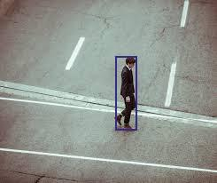
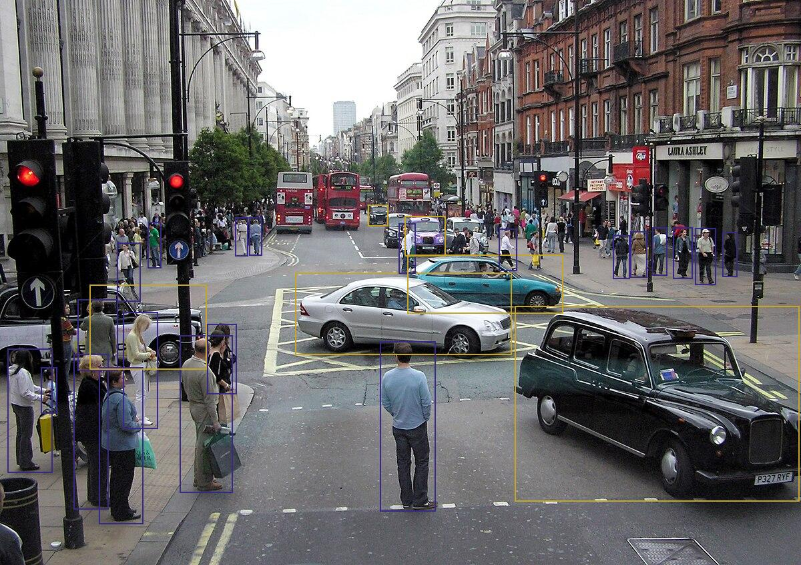

## Person and Car Detector

#### INTRODUCTION
I selected FCOS (Fully Convolutional One-Stage Object Detection) as my model for object detection, mainly because of the ratio Box MAP and number of parameters that provides (39.2 and 32.3M). This model is already trained on COCO with our objects of interest, which are person and car and their numerical labels 1 and 3 respectively. The class FCOS_ResNet50_FPN_Weights has already the preparation steps to preprocess an image, adapting it for the model input.

#### GUIDE
The docker image used to serve the model is pytorch/torchserve:latest-cpu. The container is optimized for deploying pytorch models. This method requires a .mar file, which wraps-up the model and the handler function. The handler function contains all specific treatment for the json output. In order to run the docker container, launch from root directory the following command:
```
sh scripts/launch_torchserve.sh
```
The command has a volume to see the internal logs inside folder `app/torchserve_logs`.
The model is now served for prediction in port 8080 and registered with the name fcos_model. You can directly predict an image in local as:

```
 curl http://127.0.0.1:8080/predictions/fcos_model -T app/images/car_1.jpg
 ```
Or if you want to check visually how those detections on the image look like, these are the steps to follow:
```
1. poetry install
2. python scripts/request.py
```
This way you will obtain the json output result on screen and a drawn image with all predicted bboxes saved in `app/images/output`.
You can try to predict any test image stored in folder: `app/images`

<p align="center">
    
</p> 

<p align="center">
    
</p> 
